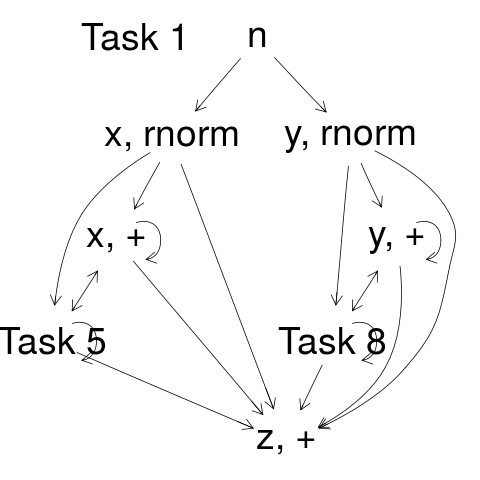

What are all the useful things to do when rewriting code?  Duncan's very
helpful docs here http://www.omegahat.net/CodeDepends/design.pdf give a
handful of reasons.

Other things that I can think of:

- Given a big ugly script, pull out the minimal set of code to produce a
  final result. For example, everything needed to make `plot(finalresult)`.
- Separate single scripts into multiple scripts if they actually have two
  independent sequences of computation.

These ideas stay much closer to the syntax and language of R compared to
what Nick is doing.

## TODO

- X Write manual parallel evaluation of the script
- Put the graph into a data structure handling the parallel blocks.
- Write automated output.

## The right data structure

If the intermediate variable `b` is not used anywhere we probably want to
collapse the following into a single block of code, since it has to happen
sequentially. Therefore adding `future` here can't help at all. Unless it
should happen at the same time as another block... then two blocks can
execute simulataneously.

```
# Begin block
a = 100
b = a + 5
c = sum(b)
# end block
```

## Ways to fail

`fit = lm(y ~ x)` doesn't detect the dependency of `fit` on `x, y`.

Following the control flow for `lm` we see the following calls:
`model.matrix.lm`, `model.frame.default`, `as.formula`. But eventually this
`y ~ x` itself must be evaluated in which case `.Primitive("~")` is called,
which certainly does something weird. But what?

Haven't yet checked things like:
`<<-, assign`

Recursion? Iterating updates?

For printing and plotting I took the naive approach of using the variable
names as node names in the graph. But this doesn't work because the graph
expects unique node names, so code that reassigns variables generates the
same name. `CodeDepends` gets around it by concatenating what looks like
the first argument with the function name, and then something with `Task`.
But this doesn't look right:



## Permuting lines of code

There are many possible scripts that can become the same task graph. The
task then is to pick the best one of these scripts.

Thought: Lines of code can run as task parallel if and only if permutation
preserves the semantics of the program.
True? Then rather than actually writing a
parallel evaluator we can permute the lines of code, inject a few comments,
and use `future` for evaluation.

Expanding on this, we could also use `future` as a mechanism for load balancing if
we have some idea how expensive each expression is. Better to
evaluate the long ones first in that case. Is that true generally?

I no longer remember the details of what the traffic simulation script
does. It would be helpful to visualize it at different levels of detail.

## Permuted scripts

Thought: Given an unordered set of expressions, could we infer what the
ordered script must be? Certainly not true in all cases, but here's a
trivial example where we could:
```
c = sum(b)
a = 100
b = a + 5
```
Would this be useful at all? Maybe for detecting errors in the code. But
that's not very interesting, because one can just do that with the regular
interpreter.
