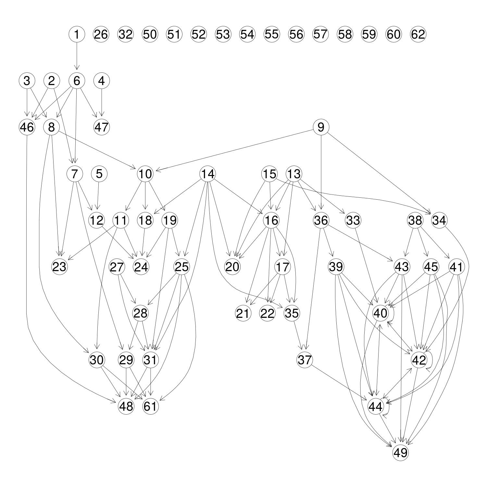
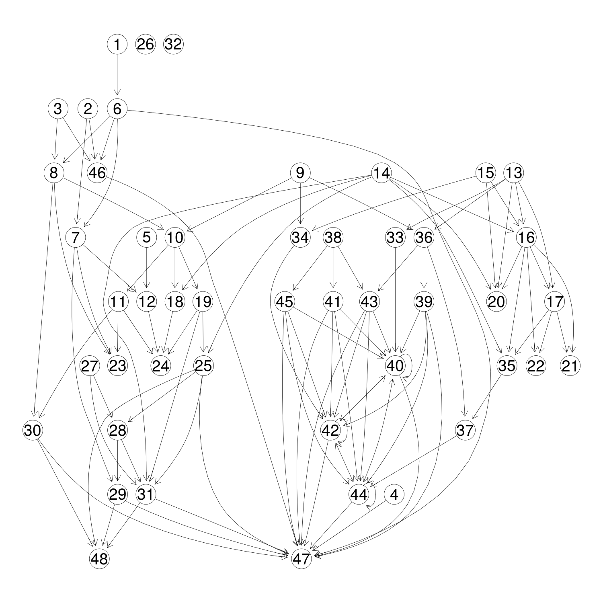
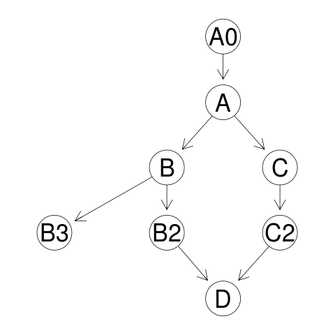
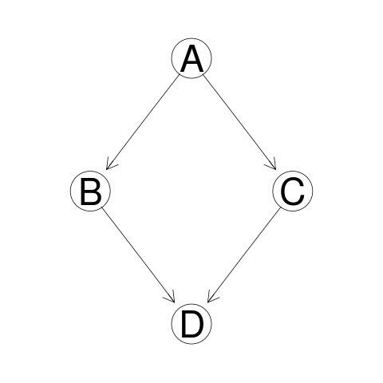

## General

What are all the useful things to do when rewriting code?  Duncan's very
helpful docs here http://www.omegahat.net/CodeDepends/design.pdf give a
handful of reasons.

Other things that I can think of:

- Given a big ugly script, pull out the minimal set of code to produce a
  final result. For example, everything needed to make `plot(finalresult)`.
- Parse Rhistory to find the minimal set of code to reproduce a result.
- Separate single scripts into multiple scripts if they actually have two
  independent sequences of computation.

These ideas stay much closer to the syntax and language of R compared to
what Nick is doing.

## TODO

- X Write manual parallel evaluation of the script
- Put the graph into a data structure handling the parallel blocks.
- Write automated output.

## Traffic Script Example

I fed in a script that performs some simple numerical approximation work
for traffic simulation. Here's the task graph:



We see that these parameters are the important inputs:

```
> frags = readScript(fname)
> # Important inputs
> frags[c(1, 6, 9, 10, 14)]

[[1]]
two6 = TRUE

[[2]]
if (two6) {
    dt_seconds = 0.3
    dx_feet = 26.4
    plotname = "dx26.pdf"
}

[[3]]
miles = 1

[[4]]
regions_per_quadrant = round(miles/(4 * dx))

[[5]]
jam_density = 280

```

This looks correct- changes here affect every aspect of the execution.

```
> # Final results
> frags[c(48, 49, 61)]

[[1]]
image(x = x, y = y, z = density2, useRaster = TRUE, col = brewer.pal(9,
    "Blues"), xlab = "Time (hours)", ylab = "Position (miles)",
    xlim = range(x), main = ttl, sub = "Orange lines are theoretical shockwaves")

[[2]]
lapply(s, function(l) lines(l, lwd = 3, col = "orange"))

[[3]]
image(x = x, y = y, z = density2, useRaster = TRUE, col = brewer.pal(9,
    "Blues"), xlab = "Time (hours)", ylab = "Position (miles)",
    xlim = range(x), main = "Starting with uniform density")

```

These also make sense, the main products are a few plots. But this fails to
capture the holistic plotting call- Every bit of plotting between:
```
pdf(...)
...
dev.off()
```
is needed to produce the complete plot.

Most of the right hand side calculates a theoretical result, while the left
hand side does the numerical approximation. They come together when
expression 49 draws the theoretical lines onto an image of the numerical
values.

One way to make `CodeDepends` recognize this dependence is to put all the
plotting call stuff in braces to make it a single expression:
```
{
pdf(...)
...
dev.off()
}
```

Here's the task graph when this change is made:



Expression 47 is the big plot that brings everything together. Previously
all those `text()` calls were single unconnected nodes, since they were
hand selected to get a nice visual result.

```
> frags2[[47]]
{
    pdf(plotname)
    image(x = x, y = y, z = density2, useRaster = TRUE, col = brewer.pal(9,
        "Blues"), xlab = "Time (hours)", ylab = "Position (miles)",
        xlim = range(x), main = ttl, sub = "Orange lines are theoretical shockwaves")
    lapply(s, function(l) lines(l, lwd = 3, col = "orange"))
    text(0.003, 0.84, "Jam", col = "white", pos = 4)
    text(0.043, 0.84, "Congested", pos = 4)
    text(0.002, 0.6, "Empty", pos = 4)
    text(0.04, 0.25, "Lane Increase", pos = 4)
    text(0.03, 0.5, "Uncongested", pos = 4)
    text(0.0064, 0.38, "First Car", pos = 4)
    text(0.05, 0.62, "Standing Shock", pos = 2)
    text(0.016, 0.88, "Jam Dispersing", pos = 4)
    text(0.019, 0.69, "Secondary\nShock", pos = 1)
    dev.off()
}
```

Other interesting pieces are nodes which don't have outgoing edges.

- 47, 48 do plotting, this makes perfect sense
- 26 calls `library()`
- 20 - 24 define functions used for the numerical simulation
- 32 defines a single function.

For example:

```
> frags2[21]

supply = function(density, lanes) {
    congested = density > (lanes * critical_density)
    ifelse(congested, fd(density, lanes), lanes * maxflow)
}
```

I'd expect to see dependencies (edges) based on where these functions are
used. For example, `supply()` above uses another function `fd()` defined in
the script. But maybe these are in another graph?


## Detection:

Not sure how to generally detect where the possibilities for
parallel are. In a simple case of k obvious threads with one common
ancestor and common child there is an obvious option:

Remove the common ancestor and child and select the k disjoint subgraphs
between them.

Alternatively:

1. Start at the top of the graph, and move down until one node has
multiple children. Gather those child threads into 2 groups.
2. Same thing starting at the bottom.

The most straightforward thing to do right now is take a more complex
graph, say something like this:



And attempt to collapse the structure into one where the parallel threads
become obvious:



The essential part for the multiprocessing is to have many "adjacent"
threads (is there a correct graph term for this?)
Optionally the adjacent threads can share a common parent and or child
nodes.


## The right data structure

If the intermediate variable `b` is not used anywhere we probably want to
collapse the following into a single block of code, since it has to happen
sequentially. Therefore adding `future` here can't help at all. Unless it
should happen at the same time as another block... then two blocks can
execute simulataneously.

```
# Begin block
a = 100
b = a + 5
c = sum(b)
# end block
```

## Ways to fail

`fit = lm(y ~ x)` doesn't detect the dependency of `fit` on `x, y`.

Following the control flow for `lm` we see the following calls:
`model.matrix.lm`, `model.frame.default`, `as.formula`. But eventually this
`y ~ x` itself must be evaluated in which case `.Primitive("~")` is called,
which certainly does something weird. But what?

Haven't yet checked things like:
`<<-, assign`

Recursion? Iterating updates?

For printing and plotting I took the naive approach of using the variable
names as node names in the graph. But this doesn't work because the graph
expects unique node names, so code that reassigns variables generates the
same name. `CodeDepends` gets around it by concatenating what looks like
the first argument with the function name, and then something with `Task`.
But this doesn't look right:


## Permuting lines of code

There are many possible scripts that can become the same task graph. The
task then is to pick the best one of these scripts.

Thought: Lines of code can run as task parallel if and only if permutation
preserves the semantics of the program.
True? Then rather than actually writing a
parallel evaluator we can permute the lines of code, inject a few comments,
and use `future` for evaluation.

Expanding on this, we could also use `future` as a mechanism for load balancing if
we have some idea how expensive each expression is. Better to
evaluate the long ones first in that case. Is that true generally?

I no longer remember the details of what the traffic simulation script
does. It would be helpful to visualize it at different levels of detail.

## Permuted scripts

Thought: Given an unordered set of expressions, could we infer what the
ordered script must be? Certainly not true in all cases, but here's a
trivial example where we could:
```
c = sum(b)
a = 100
b = a + 5
```
Would this be useful at all? Maybe for detecting errors in the code. But
that's not very interesting, because one can just do that with the regular
interpreter.
