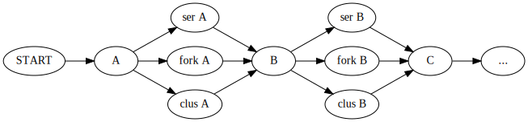

The more I think about this the more it seems these ideas are relevant to
general purpose vector based data analysis computing, not just R.
Julia and Python have the reference semantics which would change things,
but they might fit in a similar model.

The real question is: How can we make a program more efficient if we know
the entire script ahead of time? Assume we understand the semantics of the
language.


> The scheduling and mapping of the precedence-constrained task graph to
> processors is considered to be the most crucial NP-complete problem in
> parallel and distributed computing systems.

- [Omara
  Arafa](http://www.sciencedirect.com/science/article/pii/S0743731509001804)

What's the big idea here? There are often several ways to execute a program
in parallel. We want to find a way that will give us a speed improvement,
and use that one.

Wed Dec  6 09:33:05 PST 2017

# Canonical Form

Storing code in some uniform representation may help with determining
how to parallelize it.

What do I want to represent? How about a DAG representing the data flow for
the whole program. This relates to what I had before. It could be augmented
by annotating each function with being a `map` or `reduce` operation. Or
the function could be neither, just producing something new and different.

We can then compose `map` functions in parallel, which is something like
loop fusion.

Here's one example program

```{R}
x = genx()
y = f(as.integer(ceiling(x)))
z = mean(x)
fzy(z, y)
```

The idea in constructing this DAG is:

- determine whether it's worth it go parallel based on the overhead
- "fuse" nested map calls into parallel versions
- see where parallel tasks exist

This DAG should be the input to the optimization problem. Analyzing the
code to discover the DAG is a separate (very important) step.


Nodes represent functions. We annotate them with a type (TODO: better word)
`t`, with the following meanings:

- `map` apply the same operation to many elements
- `reduce` reduce from size `n -> 1`
- `general` does something other than map or reduce

The cost attribute on the node represents cost as a function of the number
of elements `n`.

Arrows represent the data flow, each arrow is a piece of data.

- `n` is the number of elements
- `size` is the size of each element in bytes, ie. 8 bytes for a double
  precision number.


## Optimization

TODO: read and cite these articles:
https://scholar.google.com/scholar?cites=4657930174210332454&as_sdt=2005&sciodt=0,5&hl=en

[DAGuE](http://www.sciencedirect.com/science/article/pii/S0167819111001347)
optimizes things dynamically. In contrast, the approach described here is
totally static.

How do general purpose systems like dask and tez approach this?
dask is a dynamic scheduler, so it is completely different.

Start from ideal code that is already in this DAG form. Suppose we're just
working with a multiprocessing fork type machine.

Objective function to minimize: total program runtime

decisions:
- which maps to run in parallel?
- which tasks to run in parallel?

constraints: 
- `p` processors can be used at one time
- statements must run in order specified by DAG

constants:
- time to fork
- time to compute function on each element in collection
- size of each collection
- transfer rate


Most data analysis programs probably aren't that large. We might have at
most a handful of tasks and a handful of maps. We can't make this into two
separate problems with maps and tasks because they're constrained by only
simultaneously using the `p` processors.

If the problem isn't too large I can solve it with an exhaustive search.
Not very elegant.

## Algorithm

I'm reading Kwok and Ahmad's "Static Scheduling Algos for allocating
directed task graphs to multiprocessors". Great overview of the state of
the art in CS until 2000- much has been done.

Then what is different about R? The tasks together with lots of
vectorization / maps are different.

I want to start based on shared read memory using `mcparallel()`. This
usually outperforms SNOW.

Perhaps the algorithm could first identify the "main" thread. This would
be the thread of flow from which all initial forks happen. Heuristically,
if an operation produces a large amount of data which will be used later
then it should be in this main thread.

If the weights on the edges measure the size of the data flowing out of
them then we can assign each node a score by summing the weights of
outgoing edges. Those with high scores should be in the main thread.

I can already think of cases where this won't work, for example when one
task produces a large data structure and the next reduces it. Then it may
prove better to execute those two together in one thread, and bring back
the small result.

Every task presents a choice. It can either be done in serial, or we can
fork and do it. If we look at it this way, we can represent that single
task node as a four nodes:

```
Task A

becomes:

        ---> serial A ----> 
start A                     end A
        ---> parallel A -->
```

I'm thinking of doing it this way so we can use a shortest path algorithm
to choose an execution strategy. The weights on the edges are the time that
this way adds to the total execution.

## Only maps

To simplify the problem, forget about task parallelism for the moment. Just
focus on maps. Consider a program that runs sequentially. We can actually
execute in three ways:

1. Serial
2. Fork
3. Use existing cluster

Depending on the size of the problem and the properties of the data
transfer any of these could be most efficient. Then we can express the
program as one flow of statements that can be executed in any of 3 ways:



A greedy shortest path algorithm could take the shortest path at each
node. Shortest path has a nice interpretation as the total run time of the
program. We could set the cost to use an existing cluster to be
infinite until we've forked at least once to create an existing cluster.
This heuristic will fail to find the global optimal solution if we have
several operations where each one costs less than the overhead to fork, but
the total run time would be smaller if we just used the same running cluster.

Alternatively we can use the existing cluster cost and check afterwards to
see if it's worth it to keep it alive.

One wrinkle is when in time the fork cluster was created, since this
determines which variables can be accessed. The cost will differ
if you have to export large variables.

It takes about 30 ms to create a fork cluster. I'm trying to improve R scripts
that take at least 10 seconds or more. Then the cost of cluster startup is
relatively small, so it's fine to assume that it happens.

Thinking more about it, the shortest path problem decomposes in this case
is totally trivial, because each one is independent.

Man I really need an example to make this tangible.

## Profiling

Just ran into this issue where calling `data.frame()` was super slow,
especially compared to `list()` and `c()`.

Looking at the code for `data.frame()` it's no surprise; that's a lot of R
code. I'm frustrated though. Last week I got caught off guard by the cost
to do names, and now this.
