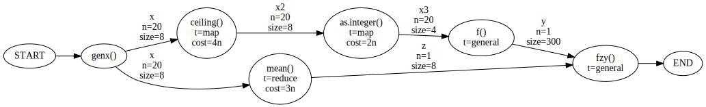

Wed Dec  6 09:33:05 PST 2017

# Canonical Form

Storing code in some uniform representation may help with determining
how to parallelize it.

What do I want to represent? How about a DAG representing the data flow for
the whole program. This relates to what I had before. It could be augmented
by annotating each function with being a `map` or `reduce` operation. Or
the function could be neither, just producing something new and different.

We can then compose `map` functions in parallel, which is something like
loop fusion.

Here's one example program

```{R}
x = genx()
y = f(as.integer(ceiling(x)))
z = mean(x)
fzy(z, y)
```

The idea in constructing this DAG is:

- determine whether it's worth it go parallel based on the overhead
- "fuse" nested map calls into parallel versions
- see where parallel tasks exist

This DAG should be the input to the optimization problem. Analyzing the
code to discover the DAG is a separate (very important) step.



Nodes represent functions. We annotate them with a type (TODO: better word)
`t`, with the following meanings:

- `map` apply the same operation to many elements
- `reduce` reduce from size `n -> 1`
- `general` does something other than map or reduce

The cost attribute on the node represents cost as a function of the number
of elements `n`.

Arrows represent the data flow, each arrow is a piece of data.

- `n` is the number of elements
- `size` is the size of each element in bytes, ie. 8 bytes for a double
  precision number.


## Optimization

TODO: read and cite these articles:
https://scholar.google.com/scholar?cites=4657930174210332454&as_sdt=2005&sciodt=0,5&hl=en

[DAGuE](http://www.sciencedirect.com/science/article/pii/S0167819111001347)
optimizes things dynamically. In contrast, the approach described here is
totally static.

How do general purpose systems like dask and tez approach this?

Start from ideal code that is already in this DAG form. Suppose we're just
working with a multiprocessing fork type machine.

Objective function to minimize: total program runtime

decisions:
- which maps to run in parallel?
- which tasks to run in parallel?

constraints: 
- `p` processors can be used at one time
- statements must run in order specified by DAG

constants:
- time to fork
- time to compute function on each element in collection
- size of each collection
- transfer rate


Most data analysis programs probably aren't that large. We might have at
most a handful of tasks and a handful of maps. We can't make this into two
separate problems with maps and tasks because they're constrained by only
simultaneously using the `p` processors.

If the problem isn't too large I can solve it with an exhaustive search.
Not very elegant.
